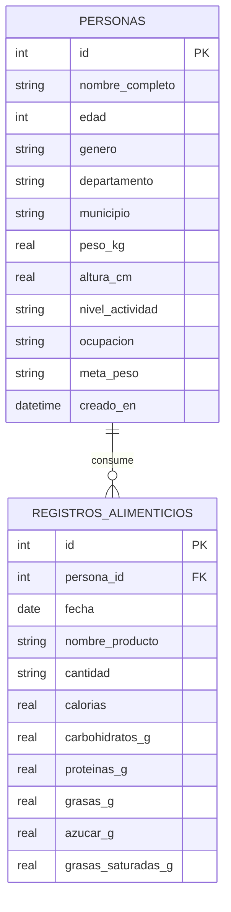

# Modelo Entidad-Relación — Proyecto Final 2026

**Título:** Análisis de hábitos alimenticios y recomendaciones de salud  
**Curso:** Programación I — UMG Chimaltenango

## Diagrama ER

## Descripción de entidades

### PERSONAS
Almacena el perfil del usuario según Fase 1 del enunciado.

| Atributo | Tipo | Restricción |
|----------|------|-------------|
| id | INTEGER | PK, autoincremental |
| nombre_completo | TEXT | NOT NULL |
| edad | INTEGER | > 0 |
| genero | TEXT | NOT NULL |
| departamento | TEXT | NOT NULL |
| municipio | TEXT | NOT NULL |
| peso_kg | REAL | > 0 |
| altura_cm | REAL | > 0 |
| nivel_actividad | TEXT | NOT NULL |
| ocupacion | TEXT | NOT NULL |
| meta_peso | TEXT | bajar / mantener / aumentar |

### REGISTROS_ALIMENTICIOS
Alimentos consumidos diariamente por cada persona.

| Atributo | Tipo | Restricción |
|----------|------|-------------|
| id | INTEGER | PK |
| persona_id | INTEGER | FK → personas(id), ON DELETE CASCADE |
| fecha | TEXT | formato YYYY-MM-DD |
| nombre_producto | TEXT | NOT NULL |
| cantidad | TEXT | NOT NULL |
| calorias | REAL | >= 0 |
| carbohidratos_g | REAL | >= 0 |
| proteinas_g | REAL | >= 0 |
| grasas_g | REAL | >= 0 |
| azucar_g | REAL | >= 0 |
| grasas_saturadas_g | REAL | >= 0 |

## Relaciones

- **PERSONAS (1) — (N) REGISTROS_ALIMENTICIOS:** Una persona puede tener muchos registros alimenticios; cada registro pertenece a una sola persona.

## Índices

- `idx_personas_depto` en (departamento, municipio)
- `idx_alimentos_persona_fecha` en (persona_id, fecha)

## Paradigmas de programación (requisito del curso)

| Paradigma | Implementación en el proyecto |
|-----------|-------------------------------|
| Estructurada | Menú secuencial, funciones de entrada/salida |
| Procedimental | Repositorios con operaciones SQL parametrizadas |
| Orientada a objetos | Clases `Database`, `PersonaRepository`, `NutritionAnalyzer`, `ConsoleMenu` |
